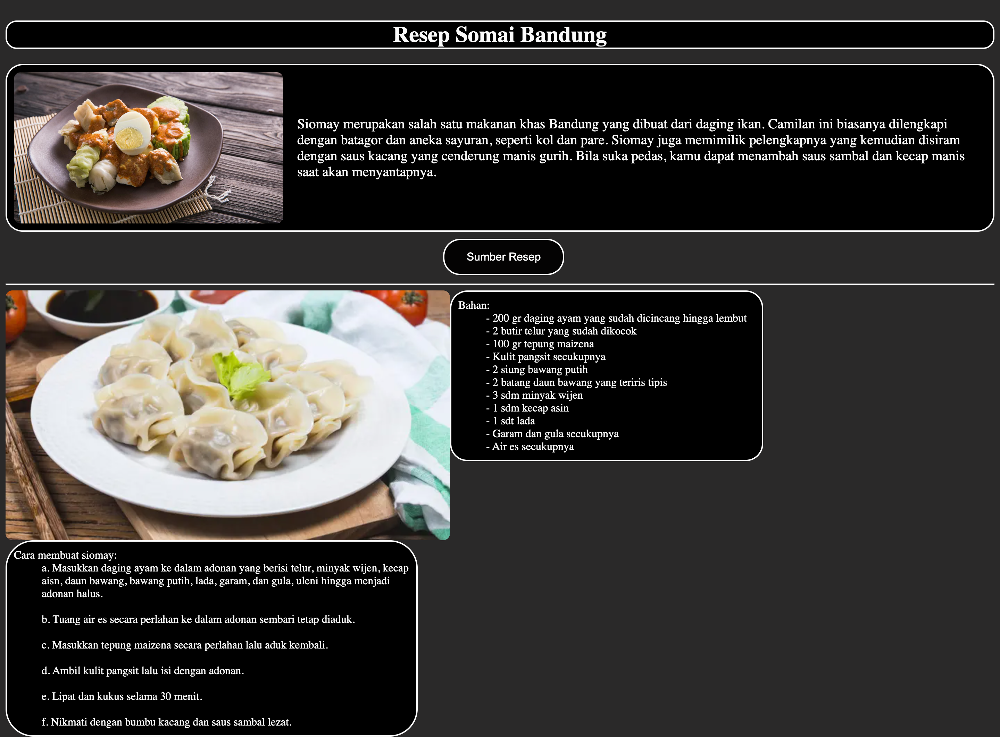

# Resep Siomay Bandung 


Deskripsi singkat proyek ini adalah tampilan sederhana HTML yang menampilkan resep Siomay Ayam Bandung.

## Tentang

Proyek ini bertujuan untuk memberikan informasi tentang resep dan cara membuat Siomay Ayam Bandung menggunakan HTML.

## Fitur

•⁠  ⁠Tampilan resep Siomay Ayam Bandung
•⁠  Sumber resep
•⁠  ⁠Informasi bahan-bahan dan cara membuat
•⁠  ⁠Foto makanan

## Demo


## Kontribusi

Jika Anda ingin berkontribusi pada proyek ini, silakan buat ⁠ fork ⁠ dari repositori ini, buat cabang baru, lakukan perubahan Anda, dan buat ⁠ pull request ⁠.

```bash
git fork [https://github.com/username/nasi-pecel-madiun.git](https://github.com/hanung07/Resep.git)
git checkout -b perubahan-fitur
# Lakukan perubahan Anda
git add .
git commit -m "Menambahkan fitur baru"
git push origin perubahan-fitur
